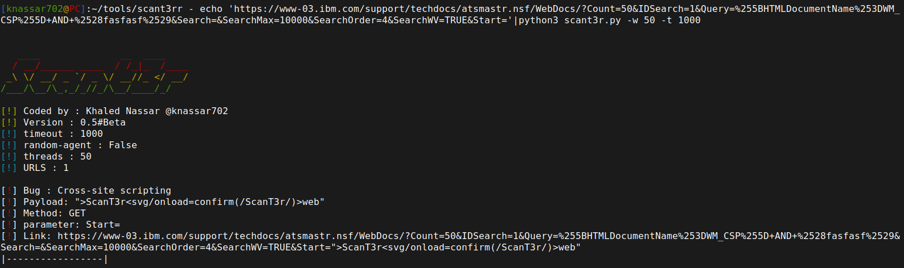

# Scant3r - web application vulnerability scanner

**Why would you use Scant3r?**

Scant3r Scans all URLs with multiple HTTP Methods and Tries to look for bugs with basic exploits as **XSS - SQLI - RCE - CRLF -SSTI** from Headers and URL Parameters
By chaining [waybackurls](https://github.com/tomnomnom/waybackurls) or [gau](https://github.com/lc/gau) <br>
with Scant3r you will have more time to look into functions and get Easy bugs on the way :)

### What will Scant3r give you?

**Scant3r will give you more time to focus on functionailities We've provided some modules to help you**

| Module              | Description                   |
| :-------------    | :-------------                |
| **lorsrf** | Bruteforcing on Hidden parameters to find SSRF vulnerability |
| **headers** | inject **SSTI - XSS - RCE - SQLI** payloads in HTTP Headers |
| **hostping** | get live domains|
| **hostinj** | Host Header injection |
| **paths** | dirbrute forcing|
| **reflect** | find reflected parameters|
| **accept** | scans website from CVE-2019-5418 | 
| **neon** | scans admin panel from CVE-2019-20141 |

**If you want to write your own module**
***
when writing your own python script, you need to learn adjust threading and option parser and fix connection errors etc..
in scant3r all you have to do is write **main** function and scant3r Amina will organize all issues (threades,errors,etc..) you will find some functions will help you to write a greate module :D

* this simple blog about this : https://knassar702.github.io/tools/2020/10/01/scant3rmodules.html
***

## Installation

### Linux 

```bash
$ git clone https://github.com/knassar702/scant3r
$ cd scant3r
$ pip3 install -r requirements.txt
```

### Update to latest version:
```bash
$ cd scant3r
$ git pull
```
**Usage**
* normal scan
```bash
$ echo "http://testphp.vulnweb.com/search.php?test=query&searchFor=1&goButton=go" | python3 scant3r.py 
```

***

* add module
```bash
$ echo "http://testphp.vulnweb.com/search.php?test=query&searchFor=1&goButton=go" | python3 scant3r.py -m headers
# note : use -S if you need to use scanner after use modules
```
* random User-agents
```bash
$ echo "http://testphp.vulnweb.com/search.php?test=query&searchFor=1&goButton=go" | python3 scant3r.py -R
```
* add custom headers
```bash
$ echo "http://testphp.vulnweb.com/search.php?test=query&searchFor=1&goButton=go" | python3 scant3r.py -H "Auth: U2NhblQzcgo=\nNew: True"
```
* add timeout
```bash
$ echo "http://testphp.vulnweb.com/search.php?test=query&searchFor=1&goButton=go" | python3 scant3r.py -t 1000
```
* add threads
```bash
$ echo "http://testphp.vulnweb.com/search.php?test=query&searchFor=1&goButton=go" | python3 scant3r.py -w 50
```
* add http/https proxy
```bash
$ echo "http://testphp.vulnweb.com/search.php?test=query&searchFor=1&goButton=go" | python3 scant3r.py -p http://localhost:8080
```
* add cookies
```bash
$ echo "http://testphp.vulnweb.com/search.php?test=query&searchFor=1&goButton=go" | python3 scant3r.py -c 'login=test%2Ftest'
```
* follow redirects
```bash
$ echo "http://testphp.vulnweb.com/search.php?test=query&searchFor=1&goButton=go" | python3 scant3r.py -r
```
* dump http requests/responses
```bash
$ echo "http://testphp.vulnweb.com/search.php?test=query&searchFor=1&goButton=go" | python3 scant3r.py -H "Auth: U2NhblQzcgo=" -d
```


* remove logo
```bash
$ echo "http://testphp.vulnweb.com/search.php?test=query&searchFor=1&goButton=go" | python3 scant3r.py --nologo
```

### ScanT3r API

```bash
$ python3 scant3r.py --api
```

### API Endpoints
* /scan/{scanid}
* parameter: `url`

| ID              | Scanner                   |
| :-------------    | :-------------                |
| **1** | XSS|
| **2** | SQLI |
| **3** | RCE |
| **4** | SSTI |
| **5** | CRLF|

#### Example:
* SSTI
```bash
[knassar702@PC]:~/tools/scant3r - curl http://127.0.0.1:6040/scan/4?url=http://localhost/search?u= -sk | jq
{
  "Bugs": [
    {
      "link": "http://localhost/search?u=%73%63%61%6e%7b%7b%36%2a%36%7d%7d%74%33%72",
      "method": "GET",
      "name": "template injection",
      "parameter": "u=",
      "payload": "scan{{6*6}}t3r",
      "target": "http://localhost/search"
    },
    {
      "data": "u=scan{{6*6}}t3r",
      "method": "POST",
      "name": "template injection",
      "parameter": "u=",
      "payload": "scan{{6*6}}t3r",
      "target": "http://localhost/search"
    }
  ]
}
```
* XSS
```bash
knassar702@PC]:~/tools/scant3r - curl "http://localhost:6040/scan/1?url=http://testphp.vulnweb.com/search.php?test=query%26searchFor=1%26goButton=go" -sk | jq
{
  "Bugs": [
    {
      "data": "test=query&searchFor=1\">ScanT3r<svg/onload=confirm(/ScanT3r/)>web\"&goButton=go",
      "method": "POST",
      "name": "Corss-site scripting",
      "parameter": "searchFor=1",
      "payload": "\">ScanT3r<svg/onload=confirm(/ScanT3r/)>web\"",
      "target": "http://testphp.vulnweb.com/search.php"
    }
  ]
}
```
### Docker 
```bash
$ docker build -t scant3r https://github.com/knassar702/scant3r.git
$ docker run --rm -d -p 6040:6040 --name scant3r -it scant3r
```

## Modules 

* **lorsrf**

```bash
┌─[knassar702@PC]─[~/tools/scant3r]
└──╼ $echo 'http://yourtarget.com/' | python3 scant3r.py -m lorsrf -w 50 -R -x 'http://myhost.burpcollaborator.net'
+-+-+-+-+-+-+-+
|S|C|a|N|t|3|r|
+-+-+-+-+-+-+-+
             ____
            / . .\
            \  ---<
             \  /
   __________/ /
-=:___________/

[!] Coded by : Khaled Nassar @knassar702
[!] Version : 0.6#Beta
    	
[!] timeout : 10
[!] random-agent : False
[!] threads : 20
[!] module : lorsrf,
[!] URLS : 3
[!] host : None
```


* **paths**
```
┌─[knassar702@PC]─[~/tools/scant3r]
└──╼ $echo 'http://localhost/'| python3 scant3r.py -m paths -w 50


   ____              __  ____
  / __/______ ____  / /_|_  /____
 _\ \/ __/ _ `/ _ \/ __//_ </ __/
/___/\__/\_,_/_//_/\__/____/_/


[!] Coded by : Khaled Nassar @knassar702
[!] Version : 0.6#Beta
    	
[!] timeout : 10
[!] random-agent : False
[!] threads : 50
[!] module : paths,
[!] URLS : 1
[!] host : None

[+] Found :> http://loaclhost/phpinfo.php
[+] Found :> http://loaclhost/PI.php
```
Note: in paths you can add your own paths 
```python
paths = {
  "/PATH":"MESSAGE", # string in response body
  "/PATH2":200 # status code
    }
```

* **hostping**
```
┌─[knassar702@PC]─[~/tools/scant3r]
└──╼ $cat ~/hunting/sony/domains.txt | python3 scant3r.py -m hostping


   ____              __  ____
  / __/______ ____  / /_|_  /____
 _\ \/ __/ _ `/ _ \/ __//_ </ __/
/___/\__/\_,_/_//_/\__/____/_/


[!] Coded by : Khaled Nassar @knassar702
[!] Version : 0.6#Beta
    	
[!] timeout : 10
[!] random-agent : False
[!] threads : 20
[!] module : hostping,
[!] URLS : 8588
[!] host : None
sony.com 54.144.253.202
intqa.sony.com 160.33.128.119
ns3.sony.com 160.33.66.20
rn.kb.sony.com 160.33.196.15
expressnetqa.sony.com 160.33.178.11
ns21.sony.com 160.33.195.4
eduqa.sony.com 160.33.128.117
br.en.kb.sony.com 160.33.196.15
ns1.sony.com 160.33.66.21
www.scea.sony.com 64.157.7.8
ca.en.kb.sony.com 160.33.196.15
la.en.kb.sony.com 160.33.196.15
la.es.kb.sony.com 160.33.196.15
us.en.kb.sony.com 160.33.196.15
```

* **neon**
```bash
# CVE-2019-20141
┌─[knassar702@PC]─[~/tools/scant3r]
└──╼ $echo http://$$$$$.com/admin/ | python3 scant3r.py -m neon


   ____              __  ____
  / __/______ ____  / /_|_  /____
 _\ \/ __/ _ `/ _ \/ __//_ </ __/
/___/\__/\_,_/_//_/\__/____/_/


[!] Coded by : Khaled Nassar @knassar702
[!] Version : 0.6#Beta
    	
[!] timeout : 10
[!] random-agent : False
[!] threads : 20
[!] module : neon,
[!] URLS : 1
[!] host : None

[!] Bug : Cross-site scripting
[!] Payload: 
[!] Method: GET
[!] parameter: q
[!] Link: q=
|-----------------|

```
* **accept**
```sh
┌─[knassar702@PC]─[~/tools/scant3r]
└──╼ $echo http://test.com/ruby/ | python3 scant3r.py -m accept


   ____              __  ____
  / __/______ ____  / /_|_  /____
 _\ \/ __/ _ `/ _ \/ __//_ </ __/
/___/\__/\_,_/_//_/\__/____/_/


[!] Coded by : Khaled Nassar @knassar702
[!] Version : 0.6#Beta
      
[!] timeout : 10
[!] random-agent : False
[!] threads : 20
[!] module : neon,
[!] URLS : 1
[!] host : None

[+] Found :> http://test.com/ruby/
```


### Demo 


**Nokia** https://www.nokia.com/responsible-disclosure/


**IBM** https://hackerone.com/ibm



