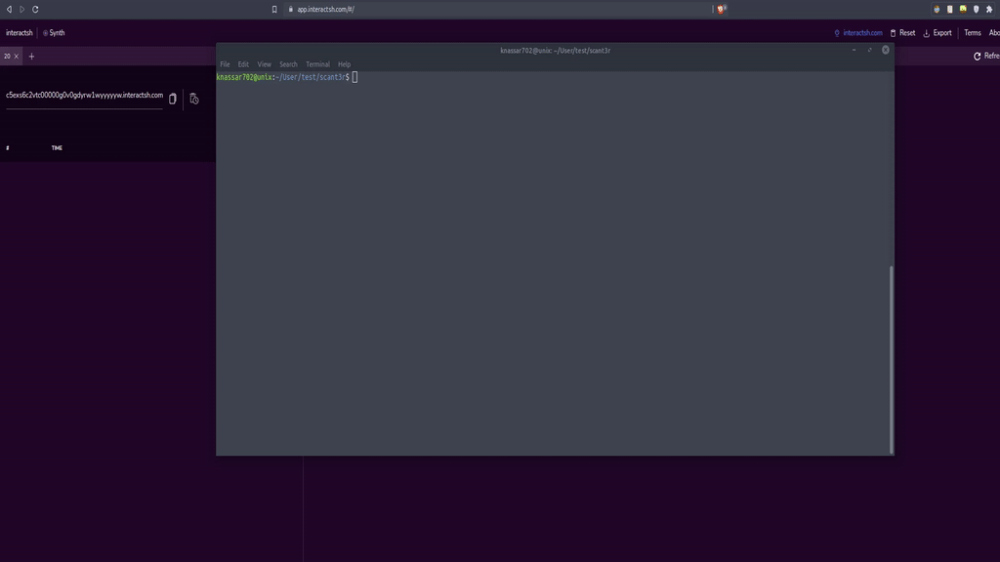
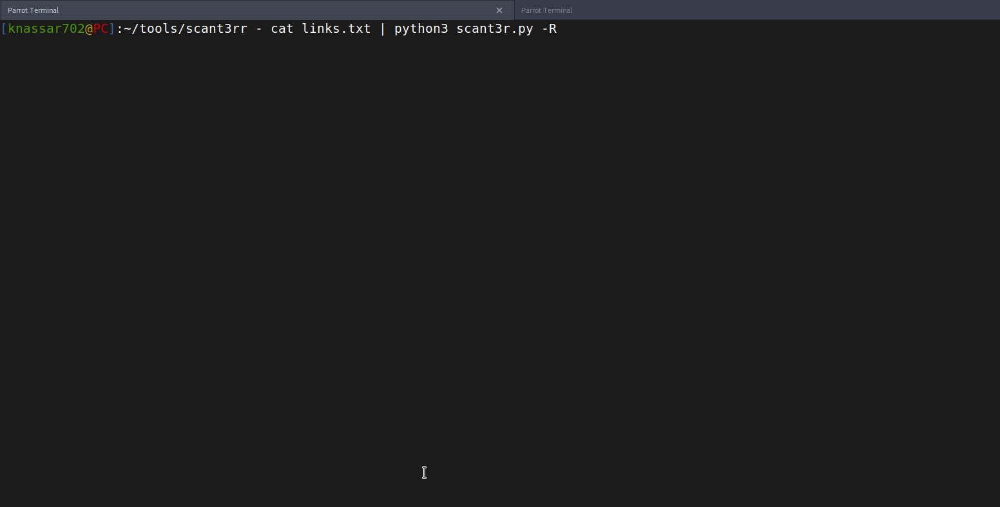
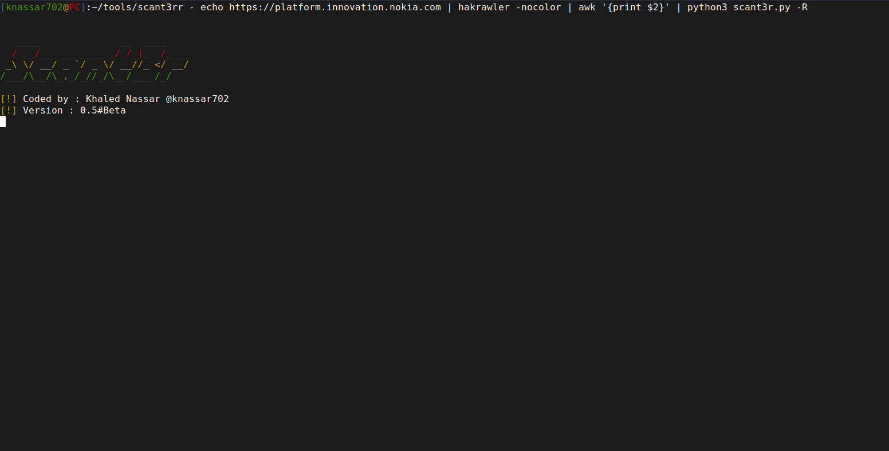

<h3 align="center">
  
</h3>


<h1 align="center">
  <br>
  <br>
  ScanT3r <br><h4 align="center">Save your scripting time</h4>
  <br>  
</h1>

<p align="center">
  <a href="https://github.com//scant3r/releases">
    
  </a>
  <a href="https://github.com/knassar702/scant3r/issues?q=is%3Aissue+is%3Aclosed">
      
  </a>
  <a href="https://img.shields.io/github/stars/knassar702/scant3r">
      
  </a>
  <a href="https://img.shields.io/github/forks/knassar702/scant3r">
      
  </a>
  <a href="https://img.shields.io/github/issues/knassar702/scant3r">
      
  </a>
  <a href="https://img.shields.io/github/license/knassar702/scant3r">
      
  </a>
</p>

***

### What's this?
this is a module-based web automation tool that I made for saving my scripting
time by providing some utilizes that every web pentester needs in his automation script
instead of focusing on ( logger, parsers, output function, cmd args, multi-threading),
just write the logic of your scanning idea with scant3r utils without caring
about these things, you can find callback/parsing/logging utils and output functions, Also we will add Restful API soon <br>
what if you need to add a new Command option to scant3r for your script? <br>
easy without writing any code just open the `conf/opts.YAML file and you will find all options of scant3r so you can change and add what you want;D


### why should I use it ?
the short answer is to save your time, as a security guy you don't need to
learn more about " how to write a perfect CLI script " you just need to
understand the logic of your script <br> if you need to write something like SSRF
CVE scanner, instead of searching "How can I call interact.sh", "how to fix this
code issue", "how can I parse this' <br> and after getting the answer you will get
some cool errors in your code and you will find yourself needing more time to
search and fix these bugs <br>

this is a waste of time for you, so this project will help to
save more and more, just take a look at the examples modules and read the
official documentation (unavailable yet), or just open an issue with a
Feature request and we will write your script with our hands

### Modules

this the modules we providing for our community for you need new module open an issue with `Feature request
` template 

| module         | Short description                                           |
| :------------- | :-------------                                               |
| **xss** | xss scanner for the ( ATTR_NAME, ATTR_VALUE , Comments, TAG_NAME ) |
| **req_callback**     | Finds Out-of-band Resources parameters |
| **ssti**       | Finds Server-side Template injection                                         |
| **firebase**   | checks for public firebase databases (write/read) permission  |

#### Requirements
* python >= 3.10
* pip
* Git

#### install
* Unix & MS-DOS

```bash
$ pip3 install git+https://github.com/knassar702/scant3r
$ scant3r --help
usage: scant3r [-h] [-e EXIT_AFTER] [-ct CALLBACK_TIME] [-c] [-o OUTPUT_FILE]
               [-H HEADERS] [-C COOKIES] [-v LOG_MODE] [-s DELAY] [-M METHODS]
               [-m MODULES] [-O] [-P LORSRF_PARAMETERS] [-l TARGETLIST] [-g] [-j]
               [-p PROXY] [-r] [-b BLINDXSS] [-x HOST] [-R] [-w THREADS]
               [-t TIMEOUT]

options:
  -h, --help            show this help message and exit
  -e EXIT_AFTER, --exit-after EXIT_AFTER
                        Exit after get this number of errors
  -ct CALLBACK_TIME, --callback-time CALLBACK_TIME
                        Callback timeout
  -c, --convert-body    Change the url parameters into request body ( in non-GET methods )
  -o OUTPUT_FILE, --output OUTPUT_FILE
                        The output json file location
  -H HEADERS, --header HEADERS
                        add custom header (ex:-H='Cookie: test=1; PHPSESSID=test')
  -C COOKIES, --cookie COOKIES
                        add cookie to the header (ex: 'cookie1=1; cookie2=2')
  -v LOG_MODE, --logger-mode LOG_MODE
                        change debug messages mode (1: info 2: debug 3: warning 4: error)
  -s DELAY, --sleep DELAY
                        number of seconds to hold between each HTTP(S) requests.
  -M METHODS, --method METHODS
                        Methods Allowed on your target
  -m MODULES, --module MODULES
                        run scant3r module (ex: -m=example)
  -O, --more-scan       scanning with the current module with import another modules (eg: lorsrf xss/ssti scanner)
  -P LORSRF_PARAMETERS, --lorsrf-parameters LORSRF_PARAMETERS
                        how many parameters in one request for lorsrf module
  -l TARGETLIST, --list TARGETLIST
                        add targets list
  -g, --add-parameters  Generate Famouse Parameters if your url dosen't have parameters
  -j, --json            JSON Request Body
  -p PROXY, --proxy PROXY
                        Forward all requests to proxy
  -r, --follow-redirects
                        Follow redirects
  -b BLINDXSS, --blind-host BLINDXSS
                        add your xsshunter host (or any xss host)
  -x HOST, --host HOST  add your host (burpcall,etc..)
  -R, --random-agents   use random user agent
  -w THREADS, --workers THREADS
                        Number of workers (default: 50)
  -t TIMEOUT, --timeout TIMEOUT
                        set connection timeout (default: 10)

for Questions/suggestions/Bugs : https://github.com/knassar702/scant3r/issues
wiki: https://github.com/knassar702/scant3r/wiki
```


### Start
```bash
$ echo "http://testphp.vulnweb.com/listproducts.php?cat=1" | scant3r -m all 
```

## TODO-Features
* [ ] Restful API
* [ ] re-write the core utils in Rust by using pyo3 
* [ ] Command line Modules ( with yaml file )
* [ ] Custom scanning map
* [ ] Selenium Modules

## Acknowledgments


#### Join us 
* https://docs.google.com/forms/d/e/1FAIpQLSfb7-67XG5d1CU-zwqux6Kfx8nCHsM0SiFlZLj8VmXZL-vSwg/viewform

## License
* [GPL 3v](https://github.com/knassar702/scant3r/blob/master/LICENSE)


### Stars Rate


***

## Media
some demo gifs from the old versions

* LorSrf


#### Version: [0.6](https://github.com/knassar702/scant3r/releases/tag/0.6)



**Nokia** https://www.nokia.com/responsible-disclosure/


**IBM** https://hackerone.com/ibm


