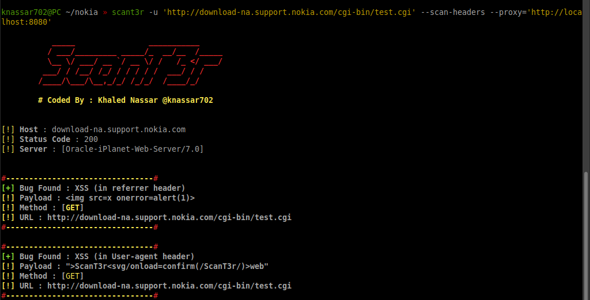
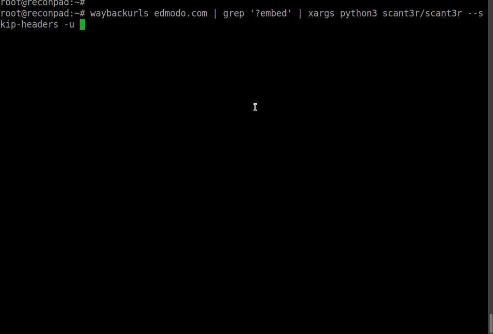

## ScanT3r - Web Security Scanner 
````

	   _____                ___________     
	  / ___/_________ _____/_  __/__  /_____
	  \__ \/ ___/ __ `/ __ \/ /   /_ </ ___/
	 ___/ / /__/ /_/ / / / / /  ___/ / /    
	/____/\___/\__,_/_/ /_/_/  /____/_/
	
	# Coded By : Khaled Nassar @knassar702

````
* ##### Detect This vulnerabilities
  * <h5>Remote Code Execution</h5>
    <ul><li>Linux</li></ul>
  * <h5>XSS Reflected</h5>
  * <h5>Template Injection</h5>
     <ul>
     <li> Jinja2 </li>
     <li> ERB </li>
     <li> Java </li>
     <li> Twig </li>
     <li> Freemarker </li>
     </ul>
  * <h5>SQl Injection </h5> 

### Screen Shot :
   * ##### Nokia Website:
      * </a>
      * 
### GIF



#### OS Support :
- <h5> Linux</h5>
- <h5> Android</h5>
- <h5> Windows</h5>

## Install
### [Linux](https://wikipedia.org/wiki/Linux) [](https://fr.wikipedia.org/wiki/Linux)
* open your terminal 
* enter this command 
   ````
   $ git clone https://github.com/knassar702/scant3r 
   $ cd scant3r 
   $ python3 -m pip install -r requirements.txt
   ````
### Andoird 
* Download <a href='https://play.google.com/store/apps/details?id=com.termux&hl=en'>Termux App</a>
* open termux app
* enter this command
````bash
 $ pkg install python -y 
 $ pkg install git -y 
 $ git clone https://github.com/knassar702/scant3r
 $ cd scant3r 
 $ python3 -m pip install -r requirements.txt
````
### Windows 
* Download <a href='https://www.python.org/downloads/windows/'>python3</a> and install it
* open your cmd
* enter this command 
````
$ python3 -m pip install -r requirements.txt
````

## Usage :
````
Options:
  -h, --help          |    Show help message and exit
  --version           |    Show program's version number and exit
  -u URL, --url=URL   |    Target URL (e.g."http://www.target.com/vuln.php?id=1")
  --data=DATA         |    Data string to be sent through POST (e.g. "id=1")
  --list=FILE         |    Get All Urls from List
  --threads           |    Max number of concurrent HTTP(s) requests (default 10)
  --timeout           |    Seconds to wait before timeout connection
  --proxy             |    Start The Connection with http(s) proxy
  --cookies           |    HTTP Cookie header value (e.g. "PHPSESSID=a8d127e..")
  --encode            |    How Many encode the payload (default 1)
  --allow-redirect    |    Allow the main redirect
  --user-agent        |    add custom user-agent
  --scan-headers      |    Try to inject payloads in headers not parameters (user-agent,referrer)
  --skip-headers      |    Skip The Headers scanning processe
  --sleep             |    Sent one request after some Seconds
  --module            |    add custom module (e.g. "google.py")
  --debug             |    Debugging Mood
````
### Example :
* post method<br>
``` $ python3 scant3r -u 'http://localhost/dvwa/vulnerabilities/exec/' --data='ip=localhost&Submit=Submit'```
* add cookies<br>
```$ python3 scant3r -u 'http://localhost/?l=2' --cookies='user=admin&id=1'```
* add timeout<br>
```$ python3 scant3r -u 'http://localhost/?l=13' --timeout=1```
* allow redirects (302,301)<br>
`$ python3 scant3r -u 'http://localhost/?l=13' --allow-redirect`
* sleeping<br>
```$ python3 scant3r -u 'http://localhost/?l=13' --sleep=2```
* debugging mood<br>
```$ python3 scant3r -u 'http://localhost/?l=13' --debug```
* scanning all headers<br>
```$ python3 scant3r -u 'http://localhost/?l=13' --scan-headers```
* skip headers<br>
```$ python3 scant3r -u 'http://localhost/?l=13' --skip-headers```
* add custom user-agent<br>
```$ python3 scant3r -u 'http://localhost/?l=13' --user-agent='CustomUseragent(v2)'```
* add encoding<br>
```$ python3 scant3r -u 'http://localhost/?l=13' --encode=2```
* add proxy<br>
```$ python3 scant3r -u 'http://localhost/?l=13' --proxy='http://localhost:8080'```
* run your own module<br>
```$ python3 scant3r -u 'http://localhost/?l=13' --module=dumper.py```
* add urls list<br>
```$ python3 scant3r --list urls.txt --threads=40```

### For Testing :
* `$ ./scant3r -u 'http://test.vulnweb.com/search.php?test=query' --data='searchFor=scant3r&goButton=go' `
* `$ ./scant3r -u 'http://test.vulnweb.com/artists.php?artist=1'`
* `$ ./scant3r -u 'https://menacoderrr.pythonanywhere.com/'`
